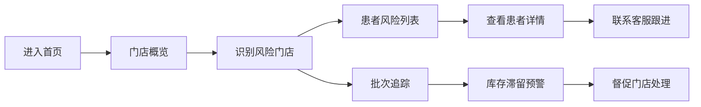

## 1. 产品概述

连锁口腔机构隐形矫治器运营数据看板，面向总部运营管理人员，实时监控各门店矫治器发放效率、库存周转及患者佩戴依从性，为运营督导、门店周会复盘和客服绩效考核提供统一数据依据。

- 解决问题：矫治器发放不及时、库存积压、患者断戴等运营痛点缺乏可视化监控手段
- 目标用户：连锁口腔机构总部运营人员、客服主管、门店经理
- 产品价值：提升运营效率，降低库存成本，改善患者治疗体验

## 2. 核心功能

### 2.1 用户角色

| 角色 | 使用场景 | 核心权限 |
|------|----------|----------|
| 总部运营人员 | 日常运营监控、周会复盘 | 查看所有门店数据、导出报表 |
| 客服主管 | 客服绩效检查、患者跟进 | 查看患者风险列表、分配跟进任务 |
| 门店经理 | 门店库存管理、发放进度 | 查看本店数据、批次追踪 |

### 2.2 功能模块

1. **门店概览**：本周应发/已发/逾期未发/提前发放统计，门店排名，风险预警
2. **患者风险**：逾期天数/缺诊次数/剩余牙套筛选，医生/客服责任人，沟通记录
3. **批次追踪**：厂家到货→分盒→入柜→发放全流程进度监控，库存滞留预警

### 2.3 页面详情

| 页面名称 | 模块名称 | 功能描述 |
|----------|----------|----------|
| 门店概览页 | 顶部统计卡 | 本周全部门店应发总数、已发总数、逾期总数、提前发放总数 |
| 门店概览页 | 门店列表 | 按门店展示本周四项指标，颜色区分正常/预警/危险状态 |
| 门店概览页 | 趋势图表 | 近4周发放趋势折线图，逾期率趋势 |
| 患者风险页 | 筛选栏 | 按逾期天数、缺诊次数、剩余牙套数量、所属门店筛选 |
| 患者风险页 | 患者列表 | 患者姓名、医生、客服、逾期天数、缺诊次数、剩余牙套、风险等级 |
| 患者风险页 | 患者详情抽屉 | 最近沟通记录、治疗阶段、历史佩戴情况 |
| 批次追踪页 | 批次列表 | 批次号、厂家、到货日期、当前状态、滞留天数、已发放数量 |
| 批次追踪页 | 批次进度条 | 分盒/入柜/发放各阶段进度及耗时 |
| 批次追踪页 | 库存预警 | 滞留超7天批次红色预警，超3天黄色预警 |

## 3. 核心流程

### 3.1 日常运营监控流程

运营人员登录系统，首先查看门店概览，快速识别风险门店；点击高风险门店下钻查看患者风险列表，针对逾期患者联系客服跟进；对于库存积压问题，进入批次追踪查看滞留批次原因。

### 3.2 周会复盘流程

每周例会时，运营人员通过门店概览对比各门店本周表现，结合患者风险数据讨论重点跟进案例，通过批次追踪分析库存周转效率，制定下周改进目标。

## 4. 用户界面设计

### 4.1 设计风格

- **主色调**：深蓝(#165DFF)作为主色，代表专业和信赖；搭配浅蓝渐变背景
- **辅助色**：绿色(#00B42A)表示正常/已完成，黄色(#FF7D00)表示预警，红色(#F53F3F)表示危险/逾期
- **字体**：使用现代无衬线字体，数字等宽显示以便数据对比
- **布局风格**：卡片式布局，顶部全局导航，左侧指标筛选，右侧数据展示
- **数据可视化**：简洁的柱状图、折线图、进度条，强调数据可读性
- **整体调性**：数据驱动、专业高效、操作极简，减少视觉干扰

### 4.2 页面设计概览

| 页面名称 | 模块名称 | UI元素 |
|----------|----------|--------|
| 门店概览页 | 顶部统计卡 | 四色数据卡片，数字大号显示，带环比趋势箭头 |
| 门店概览页 | 门店列表 | 表格+进度条，行悬停高亮，风险行底色区分 |
| 患者风险页 | 筛选栏 | 下拉选择+数字区间输入，一键重置 |
| 患者风险页 | 患者列表 | 头像+姓名+标签，风险等级用色标圆点指示 |
| 批次追踪页 | 批次卡片 | 批次号大字体，状态时间轴，进度百分比 |
| 批次追踪页 | 预警标识 | 滞留天数红色角标，闪烁动画提示 |

### 4.3 响应式

- 桌面端优先设计，适配1280px及以上宽度
- 平板端自适应，表格可横向滚动
- 不做移动端深度适配，核心功能可用即可

### 4.4 交互细节

- 数据卡片悬停时轻微上浮阴影
- 风险等级色标脉冲动画（仅危险等级）
- 页面切换平滑过渡
- 数据加载骨架屏占位
- 表格行斑马纹提高可读性
