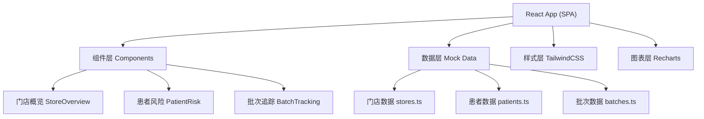

## 1. 架构设计

前端单页应用架构，数据使用Mock模拟，不依赖后端服务。采用React + TypeScript构建，使用Vite作为构建工具，TailwindCSS处理样式，Recharts实现数据可视化。



## 2. 技术描述

- **前端框架**：React@18 + TypeScript
- **构建工具**：Vite@5
- **样式方案**：TailwindCSS@3
- **图表库**：Recharts@2
- **路由**：React Router@6
- **图标**：Lucide React
- **状态管理**：React useState/useContext（轻量场景）
- **数据**：前端Mock数据，无后端依赖

## 3. 路由定义

| 路由 | 页面名称 | 说明 |
|------|----------|------|
| / | 门店概览页 | 默认首页，展示全部门店数据概览 |
| /patients | 患者风险页 | 患者风险列表及筛选功能 |
| /batches | 批次追踪页 | 批次进度追踪及库存预警 |

## 4. 数据模型

### 4.1 数据模型定义

```mermaid
erDiagram
    STORE ||--o{ PATIENT : has
    STORE ||--o{ BATCH : has
    DOCTOR ||--o{ PATIENT : treats
    CUSTOMER_SERVICE ||--o{ PATIENT : follows
    
    STORE {
        string id PK
        string name
        string city
        number weeklyTarget
        number shipped
        number overdue
        number early
    }
    
    PATIENT {
        string id PK
        string name
        string storeId FK
        string doctorId FK
        string csId FK
        number overdueDays
        number missedVisits
        number remainingAligners
        string riskLevel
        string lastCommunication
        string treatmentStage
    }
    
    BATCH {
        string id PK
        string batchNo
        string storeId FK
        string manufacturer
        string arrivalDate
        string status
        number totalQuantity
        number distributed
        number shelved
        number delivered
        number滞留Days
    }
    
    DOCTOR {
        string id PK
        string name
        string storeId FK
    }
    
    CUSTOMER_SERVICE {
        string id PK
        string name
        string storeId FK
    }
```

### 4.2 数据结构定义

```typescript
// 门店数据
interface Store {
  id: string;
  name: string;
  city: string;
  weeklyShouldSend: number;
  weeklySent: number;
  weeklyOverdue: number;
  weeklyEarly: number;
  completionRate: number;
}

// 患者数据
interface Patient {
  id: string;
  name: string;
  avatar: string;
  storeId: string;
  storeName: string;
  doctor: string;
  customerService: string;
  overdueDays: number;
  missedVisits: number;
  remainingAligners: number;
  riskLevel: 'low' | 'medium' | 'high';
  lastCommunication: string;
  lastCommunicationResult: string;
  treatmentStage: string;
  totalAligners: number;
  currentAligner: number;
}

// 批次数据
interface Batch {
  id: string;
  batchNo: string;
  storeId: string;
  storeName: string;
  manufacturer: string;
  arrivalDate: string;
  totalQuantity: number;
  status: 'arrived' | 'distributing' | 'shelved' | 'delivering' | 'completed';
  distributedCount: number;
  shelvedCount: number;
  deliveredCount: number;
  stayDays: number;
  stages: BatchStage[];
}

interface BatchStage {
  name: string;
  status: 'completed' | 'in-progress' | 'pending';
  date?: string;
  duration?: number;
}
```

## 5. 组件结构

```
src/
├── components/
│   ├── layout/
│   │   ├── Header.tsx       # 顶部导航
│   │   ├── Sidebar.tsx      # 侧边栏（如需要）
│   │   └── StatCard.tsx     # 统计卡片组件
│   ├── store-overview/
│   │   ├── StoreStats.tsx   # 顶部统计卡
│   │   ├── StoreTable.tsx   # 门店列表表格
│   │   └── TrendChart.tsx   # 趋势图表
│   ├── patient-risk/
│   │   ├── FilterBar.tsx    # 筛选栏
│   │   ├── PatientList.tsx  # 患者列表
│   │   └── PatientDrawer.tsx# 患者详情抽屉
│   └── batch-tracking/
│       ├── BatchList.tsx    # 批次列表
│       ├── BatchCard.tsx    # 批次卡片
│       └── ProgressBar.tsx  # 进度条
├── data/
│   ├── stores.ts            # 门店Mock数据
│   ├── patients.ts          # 患者Mock数据
│   └── batches.ts           # 批次Mock数据
├── pages/
│   ├── StoreOverview.tsx    # 门店概览页
│   ├── PatientRisk.tsx      # 患者风险页
│   └── BatchTracking.tsx    # 批次追踪页
├── types/
│   └── index.ts             # 类型定义
├── App.tsx
├── main.tsx
└── index.css
```

## 6. 设计规范

### 6.1 颜色系统

| 用途 | 颜色值 | 说明 |
|------|--------|------|
| 主色 | #165DFF | 品牌主色，用于关键操作 |
| 成功色 | #00B42A | 正常、已完成 |
| 预警色 | #FF7D00 | 警告、待关注 |
| 危险色 | #F53F3F | 危险、逾期 |
| 文本主色 | #1D2129 | 主要文字 |
| 文本次色 | #4E5969 | 次要文字 |
| 文本辅助色 | #86909C | 辅助说明 |
| 背景色 | #F2F3F5 | 页面背景 |
| 卡片背景 | #FFFFFF | 卡片底色 |
| 边框色 | #E5E6EB | 分割线、边框 |

### 6.2 间距系统

基础单位 4px，常用间距：4、8、12、16、20、24、32、40、48px

### 6.3 字体系统

- 标题：20px / 600
- 副标题：16px / 500
- 正文：14px / 400
- 辅助文字：12px / 400
- 数字：使用等宽字体，大号数据 28-36px
